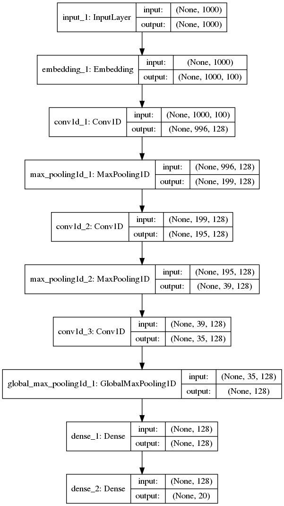

[Blog](https://blog.keras.io/using-pre-trained-word-embeddings-in-a-keras-model.html)

# What are Word Embeddings?

* a family of NLP techiques aimed at mapping *semantic meaning* into a *geometric space*.
* The geometric space formed by these vectors is called an *embedding space*.

This is done by: 

* associating a numeric vector to every word in the dictionary, such that,
* for two related words,
* the (L2/cosine) between those 2 words would reflect that relationship,
* E.g. "coconut" and "polar bear" would be far apart, "kitchen" and "dinner" should be closed to each other.

This is computed by:

* applying ***dimensionality reduction*** techniques to, 
* datasets of ***co-occurence statistics*** between words in a corpus of text,
* using *neural networks* (word2vec) or via *matrix factorization* (PCA? SVD?),
  
# GloVe word embeddings

* A popular embedding technique based on factorizing a matrix of word co-ocurrence statistics.
  

# Dataset - 20 Newsgroup

## Task
* Classify posts from 20 different newsgroups, into their original 20 categories.
* Categories are *fairly* semantically distinct, thus will have quite different words associated with them. 

## Approach
* Convert all text samples in the dataset into ***sequences of word indices***. A "word index" would simply be a *integer ID* for the word (Sequences will be limited to a length of ***1000*** words).
* Prepare an ***embedding matrix*** which will contain the i*th* embdding vector for the i*th* word.
* Load the embedding matrix into a Keras ***Embedding*** layer, set to be frozen (its weights, the emebedding vectors will not be updated during training)
* Build a 1D CNN, ending in a softmax output over 20 categories.

# Preparing the text data

1. Interate over folders containing text samples.
1. Prepare class indices.
1. Format text samples and labels into tensors, using, 
2. ***keras.preprocessing.text.Tokenizer*** `fit_on_texts` , `texts_to_sequences` and `word_index`
3. ***keras.preprocessing.sequence.pad_sequences***

# Preparing the Embedding layer

1. Compute an index mapping words to known embeddings, by parsing the data dump of pre-trained embeddings (glove.6B.100d.txt).
2. Leverage on `embedding_index` dictionary (word to vector).
3. Leverage on `word_index` (word to integer id *i* ).
4. Load matrix into embedding layer via `weights` parameter.
5. `trainable=False` to prevent the weights from being updated during training.

## Embedding layer inputs

* The input to an Embedding layer is a  2D input of shape (samples, indices) with ?? containing *sequences of integers*. Input sequences should be *padded* so that they all have the same length.

##  Embedding layer outputs

* The layer maps the integer inputs, to the vectors found at the corresponding index in the embedding matrix.
* i.e. the sequence `[1, 2]` would be converted to `[embeddings[1],embeddings[2]]`.
* The output of the Embedding layer will be a 3D tensor of shape (samples, sequence, embedding_dim)

# Training a 1D convnet

Finally

